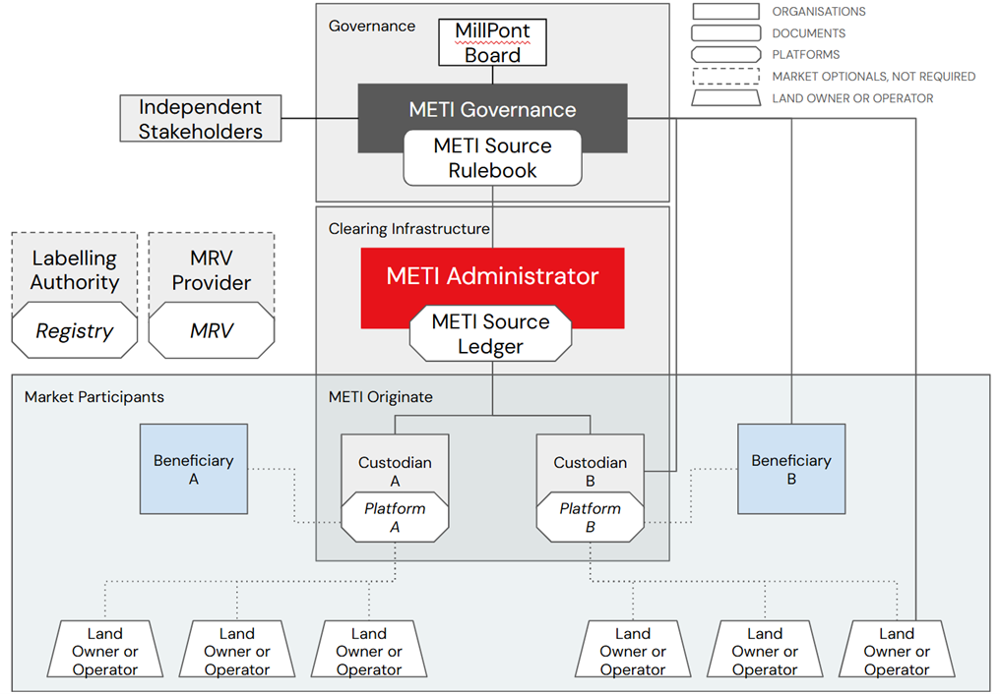

# Source Rulebook (DRAFT)

## 1.     OVERVIEW

**1.1.** **Purpose:** A core document of the MillPont Environmental Trust Infrastructure ("METI") clearinghouse platform, the METI Source Rulebook (the “Rulebook”) outlines the guidelines and protocols that govern the operations of the METI Source Ledger (“MSL”). The MSL is designed to provide a verifiable and transparent means for managing Secure Source Identifiers (“SSIDs”) tied to Environmental Attribute Certificates (“EACs”) across independent attribute tracking systems and critical font- and back-office operations in various agricultural commodities and value chains.

The Rulebook incorporates over two decades of best practices in environmental attribute tracking, aligned with both the [International Attribute Tracking Standard](https://www.trackingstandard.org/the-standard/) (“IATS”) and [the Commodity Futures Trading Commission's (“CFTC”) No Double-Counting Guidance](https://www.federalregister.gov/d/2024-23105/p-440) to prevent duplicative claims and double issuances of EACs. Through the MSL, METI enables Market Participants to securely submit, verify, and manage geospatial, temporal and attribute data, ensuring each source is uniquely registered, comparable and traceable through the EAC lifecycle in compliance with global standards for data accuracy, non-duplication, and operational transparency.

**1.2. Scope:** This Rulebook applies to all METI Originate Members, partners, and stakeholders involved in data submission, verification, and claim management through the MSL. It covers the full data lifecycle from initial submission to claim verification, including data security measures, periodic audits, and procedures for SSID conflict resolution. The comprehensive approach ensures that MSL represents the highest industry standards for accuracy, non-duplication, and reliable reporting. This Rulebook supplements the METI Terms of Use (“Terms of Use”). In the event of any conflict, the Terms of Use provisions take precedence.

&#x20;**1.3.** **General Definitions**

* 1.3.1. **Account:** A data store within METI attributed to a single Entity, used for interacting with METI clearing services and ledgers. &#x20;
* 1.3.2. **Beneficiary:** An individual, entity, or organization that receives the intangible property rights and the quantified environmental benefits conveyed through EACs. Beneficiaries can include, but are not limited to, stakeholders such as investors, public entities, private organizations, NGOs, or other parties entitled to the benefits generated by sustainable practices and interventions documented, registered, and transferred via METI.
* 1.3.3. **Custodian:** An individual, entity, or organization responsible for the custody, management, and administrative oversight of one or more Secure Source Identifiers. Custodians ensure the proper issuance, distribution, and tracking of these identifiers, and may also underwrite Environmental Attribute Certificates associated with the Secure Source Identifiers. Custodians must have active commercial agreements with Source owners (i.e., Landowners or Operators) or Beneficiaries with agreements tied to the Source owners. They are required to adhere to all applicable Terms of Use and Rulebook standards related to data integrity and compliance.
* 1.3.4. **Omnibus Custodian:** An Omnibus Custodian is an entity, typically an MRV Provider designated by one or more primary Custodians, to manage SSIDs and underwrite EACs on their behalf. Omnibus Custodians require a Declaration of Agency with METI (See Appendix 1), indicating formal authorization to administer these assets. An Omnibus Custodian is subject to the Terms of Use, relevant Rulebook/s, and financial responsibilities for the METI clearing services it utilizes on behalf of the individual or organization it holds an Account for.
* 1.3.5. **Entity:** An Entity is any legally recognized organization, institution, or individual that participates in the METI Source framework. Entities may include, but are not limited to, corporations, partnerships, non-governmental organizations, governmental bodies, and individuals acting as Custodians, Market Participants, or Beneficiaries. Each Entity is accountable for adhering to the METI Source Rulebook and associated Terms of Use, and is authorized to interact with the METI Platform, manage Accounts, and engage in SSID-related transactions under METI’s compliance and verification standards.
* 1.3.6. **Environmental Attribute Certificate (or Claim) (“EAC”):** A tradeable instrument representing intangible property rights used to quantify, verify, and track the ecosystem service benefits of climate mitigation projects. EACs may vary in their traceability, supporting ownership claims for activities like carbon reduction and renewable energy production.
* 1.3.7. **Know Your Customer (“KYC”):** The “know your customer” and other counterparty evaluation criteria as implemented on the basis of applicable laws or otherwise applied in accordance with good industry practice.
* 1.3.8. **Labelling Authority:** An organization that sets criteria for certifying EACs against its standards, ensuring compliance with specific guidelines (e.g., Verra, Gold Standard).
* 1.3.9. **Landowner or Operator:** One or more related entities which owns and or operates the Source of an EAC. Landowners and Operators can be individuals, organizations, and or groups of individuals or organizations which operate under similar ownership or organizational structures, produce similar goods or services, and are located in close regional proximity to each other.
* 1.3.10. **Local Working Instructions (“LWIs”):** A document or set of documents maintained and adopted by the Custodian that defines the procedures and standards for the creation, issuance, management, and distribution of EACs. These instructions ensure that the quality and integrity of the EACs can be defined and assessed against best practices and leading scientific standards.
* 1.3.11. **Market Participants:** Entities directly involved in EAC transactions who manage METI Accounts and exercise discretionary control over their data. Market Participants may designate third parties to manage their Accounts via a Declaration of Agency. Market Participants include Land Owners and Operators, Custodians and Beneficiaries.
* 1.3.12. **Members and Membership Status:** Organizations or individuals affiliated with METI through the METI Originate program, recognized by the METI Administrator as compliant with the Terms of Use and relevant Rulebook(s) for the clearing service(s) they use. Membership status reflects the Administrator’s confirmation of a member’s adherence to METI’s standards for custodianship, data accuracy, and operational integrity.
* 1.3.13. **METI Administrator:** MillPont, Inc., the designated manager of METI, responsible for implementing the Rulebook’s principles and overseeing platform operations.
* 1.3.14. **METI Originate:** A program that provides Market Participants with privileged access to METI’s clearing services and rights for the creation, modification, and management of records, including the METI Source Ledger.
* 1.3.15. **METI Platform:** A comprehensive system that provides open market clearing services through secure ledgers to facilitate the creation, verification, and management of SSIDs and EACs. Operating independently of specific registries, MRV platforms, or programs/projects, METI Source engages directly with diverse Market Participants to enhance collaboration, transparency, and coordination across independently managed systems.
* 1.3.16. **METI Source Ledger ("MSL"):** An electronic accounting ledger within the METI Platform that records, stores, and tracks data submissions and claims associated with SSIDs and their linked EACs. The Source Ledger maintains a transparent chain of custody and ensures the secure, verifiable provenance of environmental claims, particularly in agricultural production systems. Serving as the foundational tool for establishing and securing the exclusivity of EAC ownership, it also prevents the duplication of EAC issuances at the point of origin, supporting the integrity and trustworthiness of environmental transactions.
* 1.3.17. **MRV Platform:** A Monitoring, Reporting, and Verification platform that collects, validates, and reports data related to environmental activities linked to EACs. MRV Platforms support accurate EAC issuance by integrating field data, remote sensing, and audits to maintain verified environmental impacts. MRV Platforms can integrate with the METI Source Ledger providing validated data to create and manage SSIDs, ensuring traceability and transparency. &#x20;
* 1.3.18. **MRV Provider:** An entity that administers MRV Platforms and supports data collection and reporting tied to SSIDs and EACs. Providers verify SSID data and measure the environmental benefits being produced from climate mitigation activities and ensure ongoing auditing, compliance, and transparent environmental outcome tracking. The functions of an MRV Provider can be embedded in a Custodian’s organization (i.e., Unified Entity) and or they can operate independently as third-party auditor and verification partner.
* 1.3.19. **Omnibus Custodian:** The individual or organization responsible for the management, administration, and oversight of one or more SSIDs and EACs on behalf of another individual or organization. An Omnibus Custodian has a signed Declaration of Agency Form (See Appendix 1) on file with the Administration for each Omnibus Custodian Account it oversees and administers on the Source Ledger.
* 1.3.20. **Registry:** A database that records the ownership, issuance, transfer, and redemption of EACs. Registries may be public or private and can serve as Labeling Authorities or support multiple labels.
* 1.3.21. **Resolution Period:** A timeframe, designated by METI Administrator, during which any detected incompatibility or conflict between SSIDs must be resolved. This period allows for an investigation and corrective actions to be taken to ensure the accurate tracking and integrity of environmental claims tied to SSIDs.
* 1.3.22. **Secure Source Identifier (“SSID”):** A unique and addressable digital statement that represents exclusivity over a geographic extent for a period of time for a specific type of environmental attribute. SSIDs incorporate geospatial, temporal, and attribute ownership data to ensure secure and verifiable provenance for claims. They support data integrity, traceability, and facilitate easy comparison across different platforms and workflows. They are represented via a unique 16-character identifier which can be reference on the METI Source Ledger.
* 1.3.23. **Source:** For agricultural-based projects, a source is the point of origin of an EAC, an identifiable measurement point at the beginning of the EAC lifecycle, and is considered an individual contiguous parcel that is the smallest unit of land with: 1) A permanent, contiguous boundary; 2) Common land cover, management practice, or operational facility; 3) Common ownership or group of Land Owners and Operators, and; 4) A common project administrator (i.e. Custodian).&#x20;
* 1.3.24. **Unified Entity**: A Unified Entity is a Custodian organization that holds dual roles, acting both as the administrator and verifier of SSID data within the METI Source framework. This designation allows the organization to validate SSID-related data internally rather than through an independent third-party auditor.

&#x20;**1.4. Organizational Structure:** The Rulebook serves as an overarching governance document for METI’s Source Ledger, ensuring consistent application of the platform’s principles and procedures. The governance structure is led by the METI Governance Committee composed of industry stakeholders, METI Originate Members, and independent experts who provide strategic oversight and guidance. This committee plays a crucial role in maintaining the integrity and alignment of the Rulebook with best practices and evolving industry standards. MillPont, Inc., designated as the METI Administrator, is responsible for the practical implementation of the Rulebook’s protocols. MillPont manages the day-to-day operations, ensuring that the Rulebook’s principles, processes, and procedures are applied effectively and are continuously refined to meet the Rulebook’s requirements. This structure supports a collaborative and transparent operational framework that fosters trust and engagement among all METI Members and market participants.

&#x20;

<figure><figcaption>
METI Organizational Structure
</figcaption></figure>

**1.5. Alignment with International Standards/Protocols:** These include Greenhouse Gas Protocol (“GHGP”), Science-Based Target Initiative (“SBTi”), Value Change Initiative (“VCI”) Guidance, International Attribute Tracking Standard (“IATS”), ISO 14064-1-4, and the Commodity Future Trading Commission’s (“CFTC”) Guidance on No-Double Counting.

## &#x20;2.      Governance and Oversight

### **2.1. Role of METI Governance Committee:**&#x20;

#### The METI Governance Committee is comprised&#x20;

of METI Members, industry stakeholders, and independent experts. This governance structure ensures that METI remains aligned with the principles of transparency, integrity, and continuous improvement. This body is responsible for:

* 2.1.1. **Approving and Amending Processes:** Overseeing updates to the Rulebook and approving new or revised protocols to ensure they are seamlessly integrated into platform operations.
* 2.1.2. **Advising METI Administrators:** Providing strategic guidance to align METI processes and procedures with evolving standards and best practices.
* 2.1.3. **Ensuring Fair and Transparent Governance:** Upholding the fairness and integrity of METI operations.

**2.2. Role of METI Administrators:** METI Administrators, represented by MillPont, Inc., are tasked with maintaining the governance and oversight of METI Platform and its Source Ledger. Their primary responsibilities include:

* **2.2.1. Administering Compliance:** Monitoring member activities to ensure adherence to the METI Rulebook/s, Terms of Use, and operational protocols to maintain the platform's credibility.
* **2.2.2. Guiding Operational Integrity:** Providing guidance to align operations with industry best practices and adapting to new environmental standards and legal frameworks.
* **2.2.3. Facilitating Member Engagement:** Acting as a liaison between METI and its members to address questions, clarify procedures, and support continuous improvement in data submission and record management.
* **2.2.4. Dispute Resolution:** Acting as an independent mediator in member disputes as specified by the Terms of Use, relevant Rulebook/s, and applicable contractual agreements.

**2.3. Oversight Mechanisms:** METI Administrators employ various oversight mechanisms to uphold platform standards:

* 2.3.1. **Routine Audits and Monitoring:** Conducting periodic audits and monitoring member activities to ensure adherence to the Rulebook.
* 2.3.2. **Data Integrity Protocols:** Protecting the accuracy and reliability of data within the Source Ledger.
* 2.3.3. **Transparency and Accountability:** Members must support these administration activities by providing documentation and participating in reviews, with METI ensuring the protection of confidential information.

**2.4. Member Responsibilities:** METI Member responsibilities include:&#x20;

* 2.4.1. **Statement of Compliance:** All members of METI, including METI Originate Members, must comply fully with the Terms of Use and this Rulebook.&#x20;
* 2.4.2. **Legal Obligations:** Upholding confidentiality, intellectual property rights, and data privacy as outlined by METI.
* 2.4.3. **Data Integrity:** Submitting data that is accurate, complete, and aligned with METI’s rules and procedures to maintain a trusted marketplace.
* 2.4.4. **Transparency:** Ensuring environmental claims are verifiable and contribute to sustainability goals, reinforcing trust in the platform.

**2.5. Compliance Oversight:** METI Administrators monitor member activities to ensure compliance, while respecting business-sensitive information. Members are expected to:

* 2.5.1. Provide necessary documentation upon request.
* 2.5.2. Facilitate reviews to confirm adherence to compliance standards.

These responsibilities are integral to fostering confidence in transparent and high-integrity market operations, ensuring that all environmental claims are accurate and verifiable, and contributing to the platform’s overall mission of enhancing environmental market reliability and scale.

&#x20;**3. Guiding Principles**

The METI Source Rulebook is guided by a set of principles that define its operations, governance, and member interactions. These principles ensure that METI’s Source Ledger functions as a trusted, transparent, and adaptable platform for managing SSIDs and related data, maintaining its position as a reliable clearinghouse.

**3.1. Transparency:** Transparency is a cornerstone of METI’s Source Ledger operations, ensuring that all participants have access to essential information:

* 3.1.1. **Value Chains’ Right to Information:** METI upholds participants’ right to comprehensive information about the origin, attributes, and handling of environmental assets while balancing the protection of data sovereignty, anonymity, and trade secrets. This approach supports traceability for producers and verification confidence for end-users.
* 3.1.2. **Clear Communication:** METI prioritizes clear, accurate, and timely communication to maintain trust and facilitate effective member participation.

**3.2. Data Integrity and Accuracy:** Maintaining the integrity and accuracy of data is essential for trust in METI:

* 3.2.1. **Accurate Data Submission:** Members are required to submit complete, verified data that aligns with METI’s standards.
* 3.2.2. **Continuous Verification:** METI conducts ongoing audits and checks to ensure data quality and prevent errors.
* 3.2.3. **Evidence-Based Ownership:** Ownership of SSIDs and associated claims must be verifiable through documented evidence to uphold trust in the platform.

**3.3. Traceability and Chain of Custody:** METI is committed to ensuring robust traceability throughout the lifecycle of SSIDs and EACs:

* 3.3.1. **Unique and Exclusive Identification:** Every EAC source is assigned a Secure Source Identifier (SSID) to prevent duplication and ensure traceability. An SSID is a unique and addressable digital statement that represents exclusivity over a geographic extent for a period of time for a specific type of environmental attribute. In EAC markets, only one SSID statement has an effect at any one point in time. When an SSID overlaps with another, then a conflict exists on the METI Source Ledger until it is resolved to a distinct and exclusive claim.
* 3.3.2. **Continuous Chain of Custody:** The platform maintains a clear chain of possession from the Land Owner/Operator to the end-user/Beneficiary, supporting verifiable ownership and claims. It is mandatory that the possession of an SSID to be always verifiable.
* 3.3.3. **Compatibility with External Systems:** METI’s framework integrates with member-managed systems to align data and avoid duplication, enhancing the overall traceability of environmental assets.

**3.4. Security and Data Protection:** Protecting data and maintaining security are central to METI’s values:

* 3.4.1. **Secure Infrastructure:** METI employs robust encryption and secure infrastructure to protect data at rest and during transfer.
* 3.4.2. **Controlled Access:** Access to data is restricted to authorized members, ensuring secure data handling.
* 3.4.3. **Sustainable and Resilient Processes:** Infrastructure is designed to provide reliable and continuous service that meets market needs.

**3.5. Adaptability:** METI adapts to changes in technology, regulatory frameworks, and market requirements:

* 3.5.1. **Support for Innovation:** METI fosters the implementation and exploration of new governance models and environmental accounting frameworks.
* 3.5.2. **Flexibility:** The platform applies a principle of proportionality to ensure that operations remain fair, effective, and equitable across different scenarios.
* 3.5.3. **Continuous Evolution:** Practices and technologies are regularly updated to remain in alignment with market needs and harmonized standards.

**3.6 Independence and Fair Access:** Ensuring fairness and impartiality in market operations is fundamental:

* Non-Participation in Markets: METI Administration maintains independence by not participating in the markets it oversees, ensuring an unbiased approach and avoiding conflicts of interest.
* Inclusive Participation: METI is committed to preventing discrimination and reducing barriers to market access, ensuring broad and fair participation.

3.7 Stakeholder Engagement

METI actively involves stakeholders to align its processes with industry standards and best practices:

* Feedback Integration: Regularly soliciting feedback from members to refine procedures and enhance platform functionality.
* Collaboration: Engaging with industry leaders and complementary systems to strengthen the market’s overall reliability and cohesion.

3.8 Compliance with Regulations

The Source Ledger ensures adherence to all relevant legal and regulatory requirements:

* Regulatory Compliance: All operations are conducted in accordance with applicable laws and standards across jurisdictions to maintain legal integrity and market trust.

These guiding principles collectively support METI’s mission to operate as a transparent, secure, and adaptable clearinghouse for environmental assets, reinforcing its commitment to reliability and trust in the global marketplace.

## 4.      Custodian Responsibilities and Requirements

4.1.   General Responsibilities

The main responsibility of a Custodian is to facilitate the registration of SSIDs and underwrite and manage EACs for which the Custodian maintains contractual rights to administer. A Custodian may be any form of a legally recognizable entity, including a government authority, non-governmental organization, and or commercial enterprise.

4.1.1.      Commercial Relationships: The registration and management of SSIDs on the METI Source Ledger requires auditable commercial agreements between the Custodian and the underlying Landowner/s and Operator/s, and or, between the Custodian and Beneficiary/s who may hold the commercial relationship and agreements with the Land Owner/s and Operator/s. The commercial agreements should clearly define the services provided and ensure that the registration and management of SSIDs is aligned with those services. A Custodian may not request and manage any SSID they are not authorized to do so by a commercial agreement. Any deviations from commercial terms that would alter or remove the rights to administer SSIDs by the Custodian should be discussed with METI Administration to ensure adherence to the Principle of Data Integrity and Accuracy.

4.1.2.      Minimum  Qualifications: Custodians are required to have appropriate training, staff, and a degree of professionalism consistent with good industry practice and shall demonstrate competence to operate in the capacity for which they are serving Market Participants. This includes complying with METI’s KYC requirements and proper registration, accreditation, and licensing in compliance with the legislation in the geographies and countries wherever Custodians provide services.

4.1.3.      SSID Requests: Only a registered Custodian may request, manage and modify an SSID issued by METI. SSID requests can only be made when a Custodian has satisfied the commercial agreements required to evidence that an SSID issued on the METI Source Ledger is a unique and exclusive representation of the relevant Source for a given time period and environmental attribute. SSID requests may not be made in speculation, or prior to the effective date of administration as evidenced by the relevant commercial agreement/s. &#x20;

4.2.   Membership Requirements: Custodians shall demonstrate competence to operate in the capacity for which they are required by the METI Source Rulebook. The Administration has sole authority to assess the adequacy of adherence to the Rulebook’s requirements and grant or revoke any resulting Membership. The Administration may grant conditional or limited Membership where there are concerns related to competition, legislative implementation, or other requirements related to adherence to best practice. Unless explicitly stated, the following requirements shall apply to all Custodial Members and evidence of ongoing compliance with these requirements shall form part of the annual membership accreditation and verification process outlined in Section 7.  &#x20;

4.2.1.      Know Your Customer (KYC): Consistent with good industry practice and to comply with applicable law relating to anti-money laundering and prevention of fraud, illicit proceeds from crimes or sanctioned activities, METI Administrators shall verify:

4.2.1.1.            Identity of any natural person with controlling ownership, and or, at least one officer of the Custodian

4.2.1.2.            Legal Address of the Custodian

4.2.1.3.            Appropriate legal and fiscal registration of the Custodian

4.2.1.4.            Appropriate Local Working Instructions (LWIs)

4.2.2.      Fraud Prevention: Custodians have a responsibility to act legally and in accordance with any agreed contracts. Where the actions of Custodians raise concerns that the integrity of METI Source Ledger may be compromised, whether by malicious intent or through poor practice, METI Administration may take appropriate actions permitted under law to maintain the integrity of the METI Source Ledger and reputation and operations of its collective Members.

4.2.2.1.            Reporting Fraud: Any Custodian that suspects fraudulent activity, money laundering, tax evasion, or other illegal activity should report such a suspicion confidentially to METI Administration and the relevant authorities for review. Custodians may at any time contact relevant authorities in relation to suspicious activity or concerns related to fraud.

4.2.3.      Local Working Instructions: Custodians shall create, maintain, and operate Local Working Instructions (“LWIs”) that must comply with METI’s Terms of Use and Rulebook/s. METI Administration may review LWIs as part of the onboarding and Know Your Customer process. LWIs must clearly document how Custodians guarantee unique issuance of each EAC and exclusive chain of custody using SSIDs. The steps or checks made to ensure this unique issuance and exclusive chain of custody must be documented in a manner that is easily understood by external stakeholders. Defined aspects of LWIs include:

4.2.3.1.            Geographical and Temporal Restrictions: A Custodian shall request, manage, and administer the registration of Sources, and any affiliated temporal and attribute data, solely within the geographical and temporal scope for which it is authorized and engaged as a Custodian by the Market Participants.

4.2.3.2.            Commercial Restrictions: Custodians shall only request the registration of Sources, and manage and administer SSIDs, for which they have established commercial agreements. Custodians may act in this capacity only when formally engaged as a Custodian by Market Participants.

4.2.3.3.            Records Management: A Custodian must define how it maintains records to ensure:

4.2.3.3.1.                  The Custodian satisfies KYC requirements of this Rulebook

4.2.3.3.2.                  The Land Owners and Operators satisfy the KYC requirements of the Custodian

4.2.3.3.3.                  The Custodian is legally able to contract on behalf of Land Owners and Operators, and or Beneficiaries, for the administration of SSIDs

4.2.3.3.4.                  The Custodian is not or has not engaged in fraudulent activities.

4.2.3.3.5.                  The Land Owners and Operators are not or have not engaged in fraudulent activities.

4.2.3.3.6.                  All supporting documents submitted in support of establishing the unique and exclusive characteristics of a SSID.

4.2.3.3.7.                  These documents and records must be maintained throughout the lifecycle of a SSID and for at least three years after expiration.

4.2.3.4.            Process Outlines: The prospective Custodian must clearly define, in its LWIs, the process by which it will enroll Land Owners’ and Operators’ Sources and manage EACs produced. The Custodian must also outline how the specific steps related to registering the Sources/requesting SSIDs are completed on the METI Source Ledger.

4.2.3.5.            Data Maintenance: A Custodian must establish and document protocols to ensure that all registration data associated with Sources and affiliated SSIDs remains current and accurate. The registration of a Source may expire after a defined period from the date of its initial registration, as specified in the commercial agreement/s between a Custodian and Land Owner and Operator. Registration can be renewed or extended by the Custodian upon renewal or extension of the commercial agreements between the parties.

4.2.3.6.            Change Management for Registered Sources: After a Source has been registered and an SSID issued on the Source Ledger, the Custodians must implement procedures to identify, review, and validate any modifications to the Source that may impact the validity of the information the Source Ledger. These procedures should ensure that all changes are assessed to maintain the integrity and accuracy of METI’s services.

4.2.3.7.            Supporting Evidence Requirements: LWIs shall detail how SSIDs are issued based on verifiable evidence they represent a unique and exclusive Source. Evidence supporting the issuance of SSID must include for a specified time:

4.2.3.7.1.                   A permanent, contiguous boundary

4.2.3.7.2.                  Common land cover, management practice, or operational facility;

4.2.3.7.3.                  Common ownership or group of Landowners and Operators, and;

4.2.3.7.4.                  A common project administrator (i.e. Custodian).

4.2.4.      Third-Party Verification: Custodians shall not conduct verification of SSIDs for which they are the Custodian unless recognized as a Unified Entity by METI Administration. Custodians may engage independent third-party auditors or verification bodies to confirm SSID-related data as per Rulebook requirements. Custodians shall submit verification documentation to Administration upon request and maintain these records for a minimum period of three years following SSID expiration. This documentation must be readily accessible for METI’s audit and compliance reviews.

4.2.5.      Unified Entity Requirements: A Unified Entity is a Custodian organization that holds dual roles, acting both as the administrator and verifier of SSID data within the METI Source framework. This designation allows the organization to validate SSID-related data internally rather than through an independent third-party auditor. This status is typically reserved for Custodians with advanced verification infrastructure and proven adherence to METI’s transparency, traceability, and data integrity protocols. To qualify as a Unified Entity, the Custodian must receive formal recognition from METI Administration during Account onboarding and continue to meet the following conditions:

4.2.5.1.            Approval and Oversight: The designation as a Unified Entity is granted by METI Administration, contingent on the Custodian’s demonstrated capacity to maintain unbiased, rigorous data validation protocols and adhere to METI’s principles for data integrity, security and traceability.

4.2.5.2.            Third-Party Audit Requirement: Despite internal verification capabilities, Unified Entities are subject to periodic third-party audits by METI Administration to ensure ongoing compliance with Rulebook requirements. This additional oversight maintains data integrity and impartiality, preventing conflicts of interest within Unified Entity operations.

4.2.5.3.            Conditions for Internal Verification: As a Unified Entity, the Custodian must document robust internal processes for data validation, which must meet or exceed the requirements typically applied to independent verification bodies. These processes are outlined in the Custodian’s Local Working Instructions (LWI) and are reviewed periodically by METI.

4.3.   Annual Accreditation Process:

4.3.1.      Certification Mailings: Each year, METI Administrators will distribute certification mailings electronically to all Custodians. This process allows Custodians to review and verify the accuracy of the data they have provided, ensuring it remains current and correct. Custodians must provide feedback and revisions if discrepancies or missing information are identified.

4.3.2.      Certification Status: Once reviewed and updated data is approved, METI registers the Custodian’s data as “Certified by the Member,” signaling to market participants and third-party verifiers that the data has been actively verified and certified by the Custodian.

4.3.3.      Continuous Updates: Custodians shall notify METI Administrators of any significant data changes or corporate actions throughout the year to maintain the accuracy and reliability of data between annual certification periods.

4.3.4.      Accreditation Fee: The annual METI Originate membership fee covers the review, modification, maintenance, and certification process.

4.4.   Membership Suspension or Termination of Services: As outlined in Section 10 and Section 11 of the Terms of Use, METI Administration may suspend or terminate the provision of service to any Custodian, if the Custodian is in default, or suspected of being in default, as defined under Section 11 Terms of Use.

4.4.1.      Grounds for Suspension or Termination: Defaults that may result in suspension or termination include, but are not limited to, the following:

·       Non-compliance: Failure to comply with the Rulebook standards, Terms of Use, or KYC requirements.

·       Fraudulent Activity or Tampering: Fraudulent actions, intentional misrepresentation, or tampering with METI data or systems.

·       Falsification and Misrepresentation: Intentional or grossly negligent misrepresentation.

·       Any attempt to compromise the proper functioning of METI and the Source Ledger

4.4.2.      Notification of Suspension: METI Administration will issue a written notification of suspension to any Custodian found non-compliant with the METI Source Rulebook’s standards, KYC requirements, or other obligations. This notification shall:

&#x20;

·       Clearly specify the reason for suspension;

·       Outline the actions required for reinstatement of services;

·       Provide a five (5) business day period for the Custodian to respond and take corrective action, unless otherwise required under the Terms of Use or outlined in the notification.

&#x20;

Certain Defaults, as defined in Section 11 of the Terms of Use, may result in immediate termination without prior notification. These include, but are not limited to:

&#x20;

·       Fraudulent, illicit, or illegal activity;

·       Tampering with or damaging METI systems or participant data;

·       Violations of applicable laws.

In such cases, METI Administration reserves the right to terminate services immediately, consistent with Sections 10 and 11 of the Terms of Use.

4.4.3.      Termination and Reapplication: If the Custodian fails to respond or address the issue within this period, METI reserves the right to terminate provision of services according to the Terms of Use and Rulebook. METI Administration shall act fairly and in a non-discriminatory manner, allowing any suspended or terminated Custodian to reapply for Membership. Reapplication will be permitted provided that the Custodian demonstrates it has remedied all issues that led to the suspension or termination.

&#x20;

## 5.      Source Ledger and Data Submission Requirements

This section outlines procedures and requirements for using the Source Ledger and submitting data within the METI Platform. This section ensures that all data submissions meet METI’s standards for accuracy, traceability, and compliance, supporting the overall integrity and reliability of the platform.

&#x20;

5.1.   Entry and Exit Procedures

5.1.1.      Entry Procedures:

·       Application Review: Prospective members must submit an application, which METI Administrators review to assess eligibility based on the Terms of Use and compliance standards.

·       Onboarding Process: Approved members undergo an onboarding process that includes training on data submission protocols, the use of the Source Ledger, and adherence to METI’s Rulebook.

·       Account Setup: New members receive a METI Account, providing them with the ability to securely create, track and monitor SSIDs and associated EACs.

5.1.2.      Exit Procedures:

·       Notice of Withdrawal: Members who wish to withdraw must comply with the procedures outlined in Section 10 of the Terms of Use, which specifies the requirements for providing formal notification of their intent to exit the METI platform.

·       Reconciliation of Data: METI Administrators will conduct a review of all active SSIDs and associated data to reconcile and validate information before the member’s exit.

·       Data Archiving and Transfer: Following the reconciliation process, members' data will be securely archived or, if appropriate, transferred according to the Terms of Use and member agreements to maintain the integrity of the platform.

·       Final Audit: As part of the exit procedure, a final compliance audit may be conducted to ensure all member obligations have been met, as required by METI Administrators and in accordance with Section 10 of the Terms of Use.

5.2.   Data Submission Protocols

Data Elements for SSID Issuance Requests:

·       File Type: GeoJSON format as per IETF RFC 7946 standards

·       Type: Must be “FeatureCollection”.

·       Geometry: Must be Polygon. METI's use of polygons rather than multipolygons for SSID requests aligns with the need to represent each source as a single, continuous parcel that meets all the defined criteria for uniformity, ownership, and management. This requirement supports the integrity and transparency of the data submission and tracking process within METI’s environmental attribute system.

·       Properties:

o   Contract Start and End: Dates in ISO 8601 format.

o   Attribute: Type of environmental attribute (e.g., “carbon”).

&#x20;

Example JSON Structure:

{

&#x20; "type": "FeatureCollection",

&#x20; "features": \[

&#x20;   {

&#x20;     "type": "Feature","id":"IA3580",

&#x20;     "properties": {

&#x20;       "contractStart": "2019-10-14T15:30:00Z",

&#x20;       "contractEnd": "2025-10-14T15:30:00Z",

&#x20;     },

&#x20;     "geometry": {

&#x20;       "type": "Polygon",

&#x20;       "coordinates": \[

&#x20;         \[

&#x20;           \[-96.27745937013486, 45.152922799410504],

&#x20;           \[-96.27745937013486, 45.14703051688835],

&#x20;           \[-96.26748864422862, 45.14703051688835],

&#x20;           \[-96.26748864422862, 45.152922799410504],

&#x20;           \[-96.27745937013486, 45.152922799410504]

&#x20;         ]

&#x20;       ]

&#x20;     }

&#x20;   }

&#x20; ]

}

&#x20;

&#x20;

5.3.   Data Quality and Reliability:

&#x20;

·       Detailed Reporting: Must identify environmental benefits and establish chain of custody.

·       Auditable Records: Data must be inherently reliable and traceable to field- or facility-level for projects in the process of generating and or issuing EACs.

&#x20;

5.4.   Data Security and Integration

5.4.1.      Integration Methods: APIs and Front-End Uploads: Data can be submitted via API or through the METI Originate platform using a Custodian’s login credentials.

5.4.2.      Validation Process: Includes checks for data format, spatial integrity, and attribute consistency.

5.4.3.      Notifications: Status updates provided to Account Holders regarding the validation of their submissions.

5.5.   Validation Checks:

5.5.1.      Entity Validation: Confirms the reporting Custodian is authorized to submit data.

5.5.2.      Data Format Compliance: Ensures data consistency and scalability.

5.5.3.      Spatial, Temporal, and Attribute Integrity: Validates non-duplication and complete coverage.

5.5.4.      Aggregation Handling: Processes shared ownership data accurately.

5.6.    Compliance with Sanctions and Access Restrictions

5.6.1.      METI will ensure compliance with applicable sanctions laws, restricting access to sanctioned parties or jurisdictions as defined by the U.S. Department of the Treasury’s Office of Foreign Assets Control (OFAC) and other relevant bodies.

5.6.2.      Responsibility of Custodians: Custodians must confirm that no data is maintained on behalf of any party subject to sanctions. Any identified violation must result in immediate action, including cancellation of access and written notification to METI.

5.7.   Prohibition of Disruptive Practices

5.7.1.      Order and Data Integrity: All data must be submitted in good faith for legitimate purposes and should not disrupt the orderly conduct of the platform.

5.7.2.      Prohibited Practices: Submission of data with the intent to mislead or overload METI’s systems or those of participants is forbidden. Reckless or intentional practices that could disrupt METI’s operations or clearing services are prohibited.

&#x20;

## 6.      Chain of Custody Documentation Requirements

The Chain of Custody Documentation section outlines the essential practices and requirements for maintaining verifiable records and audit trails for data associated with Secure Source Identifiers (SSIDs) and Environmental Attribute Certificates (EACs). These practices ensure the integrity of data submissions, support compliance with METI standards, and promote transparency and trust within the platform. Members, including Custodians and Market Participants, are obligated to follow these protocols to demonstrate clear data provenance and comply with regulatory and platform-specific guidelines.

6.1.   Verification Protocols

6.1.1.      Authentication of Data: Each data submission must be verifiable to, upon request from METI Administrator, confirm its authenticity and alignment with its designated SSID.

6.1.2.      Custodial Validation: Custodians must submit, upon request, supporting documentation that evidences a clear chain of custody and legal entitlement for administration and creation of SSIDs on METI’s Source Ledger.

6.2.   Audit Trail Requirements

6.2.1.      Detailed Records: Custodians and Market Participants must maintain comprehensive records of all data submissions, transactions, and modifications, ensuring these records align with affiliated data on METI.

6.2.2.      Access to Records: Proprietary data or personal information collected for compliance purposes shall ONLY be used to the extent they are required to verify compliance with Terms of Use and relevant Rulebook protocols. Records must be made available to METI Administrators or upon request by relevant authorities for compliance and audit purposes.

6.3.   Audit Trail Components

Maintaining a reliable audit trail requires both electronic and physical documentation to support the integrity of data related to SSIDs.

6.3.1.      Electronic Logs: Logs must capture essential data such as timestamps, identifiers, details of involved parties, and any modifications or cancellations to submissions or claims.

6.3.2.      Physical Documentation: Original documents such as contracts, agreements, and proof of ownership or entitlement related to EACs must be retained. These documents should support the data recorded in the electronic logs.

6.3.3.      Data Protection and Access

6.3.3.1.            Electronic records should be securely stored to prevent unauthorized access and prevent tampering, ensuring data integrity and protection.

6.3.3.2.            Physical records must be stored in a secure, accessible location and made available for inspection upon request by METI Administrators or relevant authorities. Custodians must implement practices to protect physical records from damage, loss, or unauthorized access, ensuring they remain intact for at least 3 years or as required by applicable regulations.

6.3.3.3.            Confidentiality: Records related to environmental claims must be protected to ensure proprietary and personal information is not publicly disclosed, except in an aggregated or anonymized manner or when legally mandated.

6.3.3.4.            Compliance with Regulations: Both electronic and physical records must comply with regulatory requirements, ensuring comprehensive audit trails are maintained to support transparency and traceability.

&#x20;

## 7.      Annual Compliance Verification

Section 7 outlines the annual compliance verification standards that Custodians must adhere to, ensuring the integrity and reliability of data submissions and operations. These standards align with METI’s commitment to transparency, accuracy, and adherence to the leading standards.

7.1.   Compliance Verification

7.1.1.      Annual Compliance Review: METI will conduct regular annual audits to ensure that members uphold Rulebook standards and comply with the framework. This process verifies the accuracy and legitimacy of data and member activities according to Section 4 , Section 5, and Section 6.

7.1.2.      Randomized Audit Sampling: METI Administrators will perform audits based on a randomized selection process to create a statistically significant sample of SSID claims and Member operations. This method helps monitor platform activity effectively and ensures that the Rulebook’s standards are being met consistently across all member operations.

7.1.3.      Member Participation: Custodians selected for audits are required to submit supporting records and cooperate with METI Administrators, providing additional documentation as needed.

7.1.4.      Audit Reporting: The results of these audits will be communicated back to the Custodian. Custodians identified as non-compliant may be issued a corrective action plan, which must be addressed within 30 days to maintain Membership accreditation.

7.1.5.      Additional Compliance Checks: Specific triggers for additional compliance checks include:

7.1.5.1.            Changes in Source ownership or management.

7.1.5.2.            Significant modifications to SSID data.

7.1.5.3.            Periodic intervals based on previous audit outcomes or known risk factors.

&#x20;

## 8.      Data Security and Operational Integrity

This section outlines the security protocols and operational measures necessary for maintaining the confidentiality, integrity, and availability of data managed within the METI Platform. These guidelines support platform resilience and the protection of sensitive information related to SSIDs and EACs through best-practice industry standards.

&#x20;

8.1.   Encryption and Anonymization

8.1.1.      Data Protection: All data within the METI Platform is protected using advanced encryption protocols, both at rest and in transit, to prevent unauthorized access and tampering. These include but are not limited to:

8.1.1.1.            Encryption: All sensitive data within METI is encrypted at rest and in transit using advanced encryption protocols to protect against unauthorized access and data tampering.

8.1.1.2.            Access Controls: Data access is restricted to authorized members based on role-specific permissions. Multi-factor authentication is required for members accessing confidential information related to SSIDs.

8.1.1.3.            Confidentiality of Environmental Claims: Proprietary data related to environmental claims will be anonymized or aggregated for public reporting unless specific disclosure is legally mandated.

8.1.2.      &#x20;

8.1.3.      Anonymization Protocols: Personal and proprietary data collected for regulatory and operational purposes will be anonymized or aggregated before public disclosure, except when legally mandated, to maintain confidentiality and compliance.

8.2.    Access Controls

8.2.1.      Authorized Access Only: Data access is restricted to authorized members based on their roles. METI Administrators manage access controls to ensure only approved users can interact with sensitive data.

8.2.2.      Authentication Measures: Strong authentication protocols, such as multi-factor authentication, are employed to reinforce security.

8.3.   Business Continuity

8.3.1.      High Availability and Redundancy: The METI Platform architecture ensures data redundancy and supports automatic failover to secondary and tertiary systems for minimal disruptions. If a primary node fails, a secondary node is automatically promoted to maintain service continuity.

8.3.2.      Distributed Database Architecture: The platform uses a distributed architecture to spread data across multiple servers, enhancing scalability and continuous availability.

8.3.3.      Geo-Distribution: Cross-region data replication is used to withstand regional outages, supporting consistent service availability.

8.4.   Backup and Disaster Recovery

8.4.1.      Automated Backups: Scheduled, automated backups are conducted to enable quick data restoration in case of loss or corruption.

8.4.2.      Point-in-Time Recovery: This feature allows data to be restored to a specific moment in time, protecting against unintended data loss.

8.4.3.      Data Snapshot Capabilities: The platform supports secure data snapshots to create recovery points for reliable backup solutions.

8.5.   Data Integrity and Security Measures

8.5.1.      Continuous Data Monitoring: The platform includes monitoring tools that provide real-time oversight of database health, including logging and alerting for potential issues.

&#x20;

## 9.      SSID Conflict Resolution Process

The SSID Conflict Resolution Process is a structured approach to resolving disputes involving SSIDs. Steps include:

&#x20;

·       Pre-Dispute Communication: Encourage members to resolve potential conflicts through prompt internal discussions.

·       Formal METI Review: Submit a conflict resolution request to METI, which will acknowledge and review the submission within 5 business days.

·       Investigation and Resolution Timeline: METI aims to resolve conflicts within 45 business days. Parties dissatisfied with initial outcomes may enter mediation or proceed to arbitration under METI’s Terms of Use.

&#x20;

Since METI permits conflicting SSIDs to exist in an encumbered state until the parties resolve the overlap, members are encouraged but not obligated to proceed through each of these stages. This flexible, non-binding process allows members to manage their conflicts efficiently while ensuring fairness and transparency within the METI ecosystem.

&#x20;

9.1.   Pre-Dispute Assessment & Acting Quickly

Before a conflict arises, members are encouraged to conduct regular assessments of their data submissions and understand their obligations and potential risk areas. This proactive approach allows members to anticipate issues, and in cases where a conflict may arise, METI recommends these initial steps:

9.1.1.      Prompt Communication: Members should immediately discuss potential conflicts with their internal teams and, where relevant, with land stewards or operators. Prompt action can prevent escalation and the loss of critical information.

9.1.2.      Engagement with Farm Partners, MRV Providers, and Value Chain Members: When a potential conflict is identified, members should reach out to involved farm partners or MRV providers to clarify any discrepancies. Many conflicts can be quickly resolved at this stage by allowing these parties the chance to review and correct data.

9.1.3.      Initiating METI’s SSID Conflict Resolution Program: If direct discussions do not resolve the issue, members may proceed voluntarily to METI’s formal conflict resolution process as outlined below.

9.2.   Formal SSID Conflict Resolution by METI Administration

If members choose to use METI’s structured conflict resolution process, METI Administrators oversee the following steps:

9.2.1.      Submission of Conflicts: Members submit a formal SSID conflict resolution request via METI’s designated electronic form (See Appendix 1). The request should detail the conflict, SSID identifiers, involved parties, and relevant evidence as outlined in Section 5.1. METI reserves the right to evaluate and respond to the conflict submission as appropriate.

9.2.2.      Review and Acknowledgment: METI will acknowledge receipt of the conflict submission within five business days and conduct an initial review to assess whether the conflict is eligible for METI’s resolution process or requires a different approach.

9.2.3.      Investigation Period: METI Administrators conduct an investigation to assess the validity of the conflict, which may involve reviewing relevant data and records and requesting further information from members.

9.2.4.      Resolution Timeline: METI aims to provide an initial resolution within 45 business days of acknowledgment. If additional time is needed, METI will inform the parties of an updated timeline.

9.3.   Negotiation

If the initial METI review does not resolve the conflict to the parties' satisfaction, members may voluntarily move to the Negotiation phase, a direct, collaborative approach aimed at reaching a mutually agreeable solution.

9.3.1.      Negotiation Procedure: By mutual agreement, METI Administrators may introduce members to engage directly in discussions to explore resolutions. This stage encourages parties to exchange ideas, explore solutions, and work toward a compromise that addresses both parties’ interests.

9.3.2.      Escalation Trigger: If negotiation is unsuccessful or the parties prefer an alternative approach, they may proceed to mediation or arbitration.

9.4.   Mediation by METI or Neutral Third-Party

9.4.1.      Mediation Options: Mediation can be facilitated by METI Administrator, a member of the METI Governance Committee (not involved in the dispute), another METI Member (not involved in the dispute), or a qualified third-party mediator approved by METI Administrators. All costs of mediation, including fees, are borne by the disputing parties.

9.4.2.      Mediation Procedure: The mediator facilitates discussions to help parties reach a collaborative, non-binding solution. Mediation remains voluntary throughout, allowing parties to opt out if preferred.

9.4.3.      Confidentiality: All information shared during mediation remains confidential to protect member privacy and encourage open dialogue. Neither METI nor the mediator will disclose details unless legally mandated.

9.5.   Transition to Arbitration: If mediation does not yield a resolution or the parties opt to proceed without mediation, members may voluntarily elect to move to arbitration in accordance with the procedures described in METI’s Terms of Use.

9.5.1.      Arbitration Administration: Arbitration is administered by the American Arbitration Association (AAA), with options tailored to the size of the dispute:

9.5.1.1.            Expedited Commercial Rules for disputes up to $100,000.

9.5.1.2.            Commercial Arbitration Rules for disputes exceeding $100,000.

9.5.2.      Arbitration Procedures:

9.5.2.1.            Limited Disclosures: Disclosure is restricted and managed by agreement or as ordered by the arbitrator.

9.5.2.2.            Confidentiality and Finality: Arbitration proceedings and awards are confidential. A final award may be confirmed in an appropriate court, ensuring the privacy and finality of the process.

9.6.   Documentation and Recordkeeping

9.6.1.      Record of Proceedings: All stages of conflict resolution, from initial METI review to negotiation, mediation, and arbitration, will be documented. Records will be securely stored and disclosed only when legally required or to parties directly involved.

9.6.2.      Confidentiality Assurance: METI ensures that all dispute-related records remain confidential and only disclosed to the extent legally mandated.

9.7.   Unresolved SSID Conflicts

For conflicts that remain unresolved, METI allows conflicting SSIDs to exist in an encumbered Conflict status on the Source Ledger.

9.7.1.      Encumbered Conflict Status: Unresolved SSID conflicts will maintain an encumbered status on the Source Ledger until the conflict is resolved.

9.8.   Final Authority: METI Administration reserves the right to determine the handling of unresolved SSIDs in Conflict status.

## 10.  Rulebook Governance

The METI Governance Committee (The “Governance Committee”) plays a crucial role in overseeing the development and implementation of operating governance procedures outlined in the METI Rulebook. This committee ensures the integrity, effectiveness, and transparency of METI's operations, guiding the organization towards achieving its mission and vision.

10.1.                    METI Governance Committee’s Mission

The Governance Committee’ mission is to establish and maintain robust governance structures that support METI's commitment to sustainability, transparency, and innovation in environmental markets. The Governance Committee will oversee the creation and implementation of policies and procedures that ensure the credibility and reliability of METI's services and products.

10.2.                    Tasks

The METI Governance Committee will meet regularly with METI management to review the development of METI's programs and address strategic and major operational issues. The committee members fullfill the following tasks:

10.2.1.  Rulebook Oversight: Oversee the development, implementation and refinement of the METI Rulebook and its operational procedures, including but not limited to formation of an industry accepted dispute resolution mechanism, core principles of governance, and the orientation of procedures and processes to meet an evolving regulatory landscape.

10.2.2.  Exchange, discuss, and advise: Support strategic, future-oriented developments of METI with professional expertise and scientific background.

10.2.3.  Program review: Regularly review the progress and development of METI's programs.

10.2.4.  Operational involvement: Participate in strategic and major operational issues and their respective implementation measures.

10.2.5.  Stakeholder communication: Network and communicate with relevant stakeholders, including researchers, civil society, and private sector entities, to enhance the publicity and credibility of METI's programs.

10.3.                    Composition: The METI Governance Committee will comprise a minimum of three and up to eight Market Participants, and or, experts industry stakeholders. Key stakeholder groups, such as regulators, carbon accountants, traders, CPGs, retailers, researchers, NGOs, and civil society organizations, will be represented in the committee. The composition of the external members will be equally distributed among different stakeholder groups, with an emphasis on representation and experience.

10.3.1.  Individual roles: Members will hold individual positions, not representing their companies.

10.3.2.  Leadership: The committee will be chaired by an independent Chairperson, supported by a Vice Chairperson. These positions will be elected by the committee members immediately after its formation, with each term lasting three years.

10.4.                    Tenure

10.4.1.  Appointment of New Members New members are elected to the Governance Committee by a simple majority vote of the current members. Abstaining from a vote is counted as a no-vote. Nominations for the Governance Committee are for a term of three years, with the possibility of re-nomination for subsequent terms.

10.4.2.  Termination: Governance Committee members may resign at any time by submitting written notice to the Chairperson. Members are expected to uphold and act in alignment with the mission and objectives of the METI. A member can only be dismissed for a valid reason and requires two-thirds majority of existing Governance Members for removal. Valid reasons include, but are not limited to:

10.4.2.1.        Breach of Fiduciary Duty: Failure to act in METI's best interests, including neglect of duties, misuse of METI information, or personal gain at METI’s expense.

10.4.2.2.        Conflict of Interest: Engaging in activities that directly compete with or undermine METI’s mission or create an unresolved conflict of interest.

10.4.2.3.        Unethical Conduct or Reputational Risk: Actions that compromise METI's reputation or conflict with its values, such as violations of legal or ethical standards.

10.4.2.4.        Failure to Participate: Repeated failure to participate in committee activities or fulfill agreed-upon responsibilities, impacting the committee's function.

10.5.                    Meeting and Voting Procedures

10.5.1.  The Governance Committee is required to meet in person at least once a year. Additional quarterly meetings are held virtually (e.g., via telephone conference or shared screen session) with specific thematic focuses, coordinated with Governance Committee members.

10.5.2.  Each Advisory Board member holds one seat and one vote. Voting is conducted by a show of hands with an abstaining vote considered a no-vote.

&#x20;

## 11.  Rulebook Updates Procedures

11.1.                    Update Schedule

11.1.1.  Quarterly Updates\
The METI Rulebook is updated quarterly to incorporate minor adjustments, clarifications, and non-substantive changes. These updates are intended to enhance clarity, ensure compliance, and support efficient operations.

11.1.2.  Annual Comprehensive Update\
Once a year, METI Administration conducts a comprehensive review of the Rulebook to incorporate substantial updates, strategic improvements, and necessary regulatory changes. This annual update serves as a broader opportunity to address significant policy changes and refine the Rulebook to align with METI’s long-term goals and evolving standards in the environmental markets sector.

11.2.                    Update Procedures

11.2.1.  Proposal Collection and Compilation: METI Administration collects proposed updates from a variety of sources, including regulatory changes, internal audits, member feedback, and operational reviews. Each proposal is documented in a Change Proposal Document, detailing the rationale, anticipated impact, and any regulatory or operational requirements. Administration presents the compiled proposals and feedback to the Governance Committee for review and prioritization 30-days prior to scheduled quarterly meetings.

11.2.2.  Review and Vetting by Governance Committee: The Governance Committee, consisting of legal, compliance, METI members, and subject matter experts, reviews each proposal to ensure alignment with METI’s mission, regulatory standards, and the Rulebook’s objectives.

11.2.3.  Preliminary Assessment and Voting: The Committee conducts a preliminary assessment of each proposal to determine its relevance and potential impact. Proposals that receive a simple majority in a preliminary vote proceed to the next stage, the public comment period.

11.2.4.  Public Comment Period: METI Administration posts the proposed updates on the Service Site under “Notice of Proposed Rulebook Updates for Public Comment.” A 30-day comment period allows members and stakeholders to review and provide feedback. During the public comment period, METI facilitates engagement opportunities, such as Q\&A sessions, to provide members with clarity on proposed changes and gather stakeholder insights on potential impacts.

11.2.5.   Final Review, Adjustment, and Voting: The Governance Committee reviews feedback from the public comment period and incorporates relevant adjustments into the proposed updates to improve clarity, address operational concerns, or refine compliance measures. The Governance Committee holds a final vote on the adjusted updates. A two-thirds majority is required for approval, and significant updates require endorsement by the METI Executive Board to ensure strategic alignment.

11.2.6.  Monitoring and Adjustment: Following implementation, METI initiates a 60-day Cure Period to monitor the effectiveness of the updates, ensuring that they meet their intended objectives without unintended impacts. During this Cure Period, METI Administration gathers additional feedback from members regarding any challenges or unforeseen issues. If necessary, METI Administration will make adjustments to ensure compliance and support alignment with the Rulebook’s standards.

11.3.                    Effective Date: Quarterly updates take effect on the first day of the following quarter. Annual updates are implemented at the beginning of the second quarter of the calendar year, allowing adequate time for members to prepare.

11.4.                    Documentation and Change Log Entry

11.4.1.  Entry into Change Log: Approved updates are recorded in the METI Rulebook Change Log, accessible on the Service Site. Each entry includes the effective date, rationale, and a summary of feedback responses.

11.4.2.  Member Notification: METI Administration sends a formal notification to all members via email, detailing the approved updates and providing any necessary
